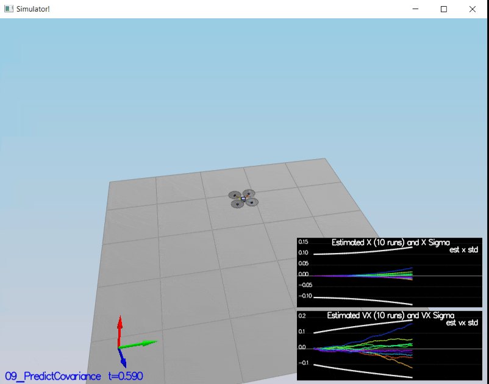

# FCND-Estimation

## Overview ##
In this project an Extended Kalman Filter (EKF) was implemented to predict a quadrotors state. 

The code is the /src directory, and below the files changed during the implementation:

- [/config/QuadEstimatorEKF.txt](./config/QuadEstimatorEKF.txt): This file contains the parameters for tuning the EKF. 
- [/src/QuadEstimatorEKF.cpp](./src/QuadEstimatorEKF.cpp): This is the EKF implementation. 
- [/src/QuadControl.cpp](./src/QuadControl.cpp): This is the cascade PID control implemented on the last project. 
- [/config/QuadControlParams.txt](./config/QuadControlParams.txt): It contains  parameters for the control code. 

## Step 1 Sensor noise ##

For the controls project, the simulator was working with a perfect set of sensors, meaning none of the sensors had any noise.  The first step to adding additional realism to the problem, and developing an estimator, is adding noise to the quad's sensors.  For the first step, we estimated the standard deviation of the quad's sensor

## Step 2 Attitude Estimation ##

In this step,  the complementary filter-type attitude filter was improved with a better rate gyro attitude integration scheme.
For this simulation, the only sensor used is the IMU and noise levels are set to 0 (see `config/07_AttitudeEstimation.txt` for all the settings for this simulation).  

## Step 3 Prediction 1 ##

In this step the prediction step of filter was implemented.

This scenario is configured to use a perfect IMU (only an IMU). Due to the sensitivity of double-integration to attitude errors, the accelerometer update is very insignificant.

## Step 4 Prediction 2  ##

This scenario is configured to use realistic IMU with noise

## Step 5 Magnetometer Update ##

In this step, the state updated with the magnetometer measurement.

## Step 6 Closed Loop + GPS Update ##

